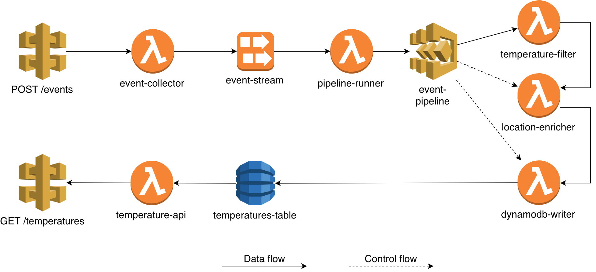

Exercise 6 - All Together Now
=============================

## Setup

- Install Serverless plugins: `npm install` (first time)
- Start LocalStack, see top level [README](../README.md)

## Exercise

Implement the temperature event pipeline as shown in
